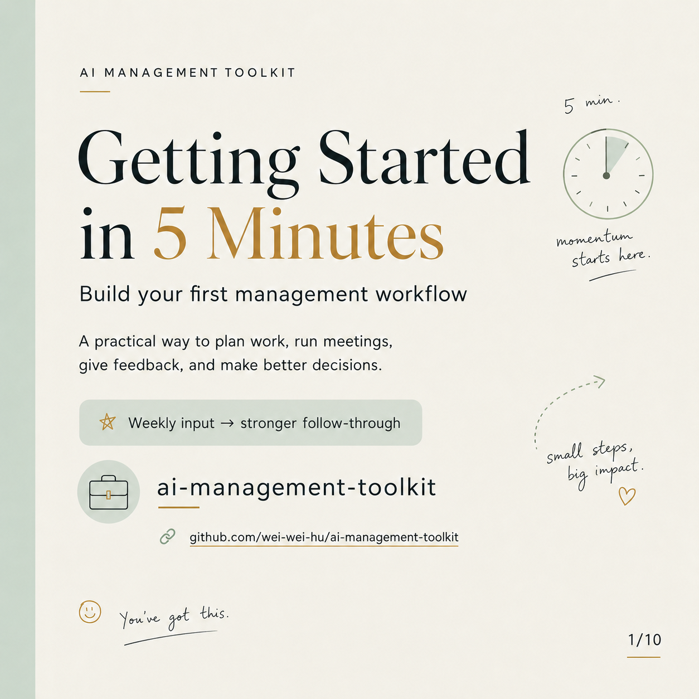

# AI Management Toolkit

Practical AI management toolkit: weekly planning, meeting agendas, feedback scripts, performance reviews, and decision briefs.

### ▶ Get Started with AI Management Toolkit

<a href="https://youtube.com/shorts/9ZER-SAf6n0"></a>

*From one-off prompting to a weekly operating workflow. A quick look at how it works.*

A Claude skill for managers who'd rather run their team deliberately than from memory. It turns scattered notes, tasks, meetings, feedback moments, blockers, and decisions into usable management outputs like weekly operating plans, meeting agendas, feedback scripts, decision briefs, and performance reviews. And it keeps track across weeks, so things are less likely to quietly slip by.

## Why this exists

The hard part of managing usually isn't *making* the plan. It's the **follow-through and pattern-recognition** that come after. A task that's quietly slipped a few weeks. A report you haven't had a real 1:1 with in a while. A blocker that's been "handled" for a couple of weeks. These are easy to lose track of in any single week, and they tend to show up only when you look across several. When you're holding it all in your head, some of it slips.

The templates in here are useful, but they're easy to find elsewhere. What's harder to do on your own comes down to two things:

**Continuity: it keeps track week to week.** Each week builds on the last. Unfinished work carries forward, tasks slipping several weeks get flagged as a pattern rather than just re-deadlined, repeat blockers get surfaced, and anyone overdue for a 1:1 gets noted before it becomes a problem.

**Guardrails: it stays grounded and accountable.**

- **It doesn't make things up.** It uses only the facts you give it, and won't invent employee behavior, performance history, or HR details. (A common pitfall when using AI for people decisions.)
- **It builds in accountability.** Each decision and action item carries an owner, a deadline, and a follow-up.
- **It keeps feedback fair and grounded.** It separates facts, impact, expectations, and support, which helps hard conversations stay specific and fair.

## What it's for / not for

This skill helps you **draft and organize** management thinking. It does not make decisions for you, and it is not a substitute for HR, legal, or company process. Sensitive matters like performance actions, compensation, and terminations need human review and policy checks. You own every decision.

## What it does

The skill follows a weekly operating process:

1. **Plan** the work
2. **Align** the team
3. **Remove** blockers
4. **Coach** people
5. **Make** decisions
6. **Capture** performance and learning
7. **Restart** next week with better inputs

It routes each request to the right template: SMART goals, WBS, RACI, SWOT, 5W2H, root-cause, PDCA, one-on-ones, feedback scripts, and weekly reviews.

## A week with the toolkit

The routine maps onto a normal workweek, so each day has one clear management job:

| Day | Focus |
|---|---|
| **Monday** | Plan the work |
| **Tuesday** | Run the team meeting |
| **Wednesday** | Coach and give feedback |
| **Thursday** | Make decisions and adjust work |
| **Friday** | Review performance and prepare next week |

In practice it's two small habits. **Every Friday**, jot three things: what got done, what's stuck, who needs attention. **Every Monday**, paste those in and ask for the week's plan. The skill reads last week, carries forward what's unfinished, flags what's drifting, and hands you priorities, owners, deadlines, and the one or two conversations the week is pointing to. Ten minutes a week, and fewer things fall through the cracks.

**Who it's for:** any manager who'd rather not run their team from memory: first-time, new-to-a-team, and experienced-but-stretched alike. (If anything, the more you're juggling, the more the week-to-week tracking helps.)

## What's inside

It's a concrete set of ready-to-use building blocks the skill routes between:

- **30 prompts** for planning, meetings, blockers, feedback, decisions, recognition, workload balance, and weekly reflection.
- **11 meeting templates** for weekly meetings, one-on-ones, decision meetings, problem-solving, retrospectives, workload reviews, employee development, and running your own 1:1 with your manager.
- **10 feedback scripts** for praise, teamwork, problem-solving, missed deadlines, quality issues, communication gaps, conflict, prioritization, leadership growth, and performance concerns.
- **10 work planning templates** using SMART goals, WBS, RACI, progress tracking, project risk planning, and team capacity.
- **5 decision templates** using SWOT, 5W2H, option comparison, root-cause analysis, and PDCA.
- **5 performance review templates** for annual reviews, quarterly check-ins, promotion readiness, performance improvement, and employee growth.

That's **30 prompts and 41 templates and scripts**, plus one weekly routine that ties them together.

## Install

This is a personal Claude Code skill. Drop the folder into your skills directory:

```bash
git clone https://github.com/wei-wei-hu/ai-management-toolkit.git \
  ~/.claude/skills/ai-management-toolkit
```

Then reload Claude Code. Invoke it with `/ai-management-toolkit` or just describe a management task ("build my weekly team plan from these notes").

## Structure

```
ai-management-toolkit/
├── SKILL.md                  # Skill definition + routing logic
├── resources/                # Templates, prompt library, operating map
│   ├── weekly-operating-map.md
│   ├── weekly-continuity.md   # Week-over-week loop: carry-forward + pattern detection
│   ├── work-planning-templates.md
│   ├── meeting-templates.md
│   ├── feedback-scripts.md
│   ├── decision-templates.md
│   ├── performance-review-templates.md
│   ├── prompt-library.md
│   ├── manager-input-intake.md
│   ├── source-method.md
│   └── kit-index.md
├── journal/                  # One file per week: the saved plans continuity reads
│   ├── README.md             # Convention + standard weekly file format
│   └── example-week.md       # Fictional sample entry
└── examples/                 # Trigger and install/test examples
    ├── install-and-test.md
    └── trigger-examples.md
```

## How continuity works

Continuity runs on a simple convention. Each week's plan is saved as one dated file in `journal/` (the skill writes it for you), and every Monday it reads the most recent one before planning the new week. That's the mechanism behind everything in "A week with the toolkit" above: carrying work forward, spotting multi-week slips, and catching repeat blockers. The [Example](#example) below shows what it produces.

Full logic lives in `resources/weekly-continuity.md`. One caution: journal entries describe real people, so keep them private if your repo is public. The included example uses fictional names.

## Example

**You give it** last week's saved plan plus three Friday notes:

> *Maya still hasn't shipped the QA checklist, Sam's vendor API is finally unblocked, Priya is exhausted.*

**It produces** this week's plan, opening with a continuity summary:

```
## Continuity summary (vs. week of 2026-06-08)
- Carried forward: 1 item, now slipping a 4th week (Maya's QA checklist)
- Repeat blockers: 0 open (vendor API resolved this week)
- People needing attention: Priya (~4 weeks, no 1:1, exhausted, urgent)
- Closed since last week: vendor API unblocked, Sam's integration moving

## Top priorities
1. Blocker conversation with Maya. Do NOT just re-deadline the checklist
   (it has slipped 4 weeks; another date won't fix what 3 dates didn't).
2. Check in with Priya this week. Burnout signal, not a scheduling gap.
3. Get Sam's now-unblocked integration to done while momentum is there.
```

This is the kind of thing a single prompt tends to miss: it caught the **4-week slip** and suggested talking rather than re-deadlining, **closed the loop** on the repeat blocker, and **counted the weeks** since Priya's last 1:1 to flag possible burnout. Every flag traces back to recorded facts.

## Usage examples

- "Here are my messy Friday notes. Build next week's manager plan."
- "Help me prepare a one-on-one with an employee who missed a deadline twice."
- "We have three options for a delayed launch. Create a decision brief."
- "Turn these meeting notes into decisions, action items, and follow-ups."

## Note

This skill helps draft and organize management work. Sensitive HR, legal, compensation, and termination decisions require human review and appropriate company policy checks. The manager owns every decision.

## License

© 2026 Weiwei Hu. Licensed under [CC BY-NC-ND 4.0](https://creativecommons.org/licenses/by-nc-nd/4.0/).

You may share this work with attribution, but **not** use it commercially or distribute modified versions. For any other use, please contact me for permission. See [LICENSE](LICENSE) for full terms.
